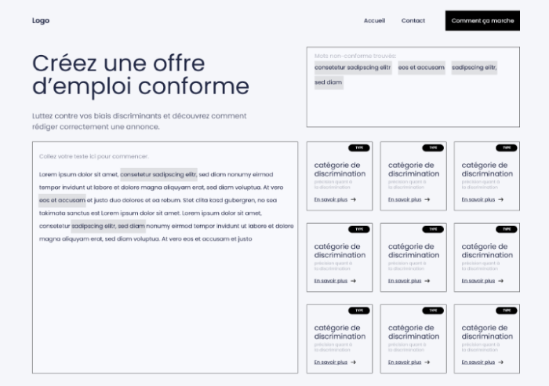
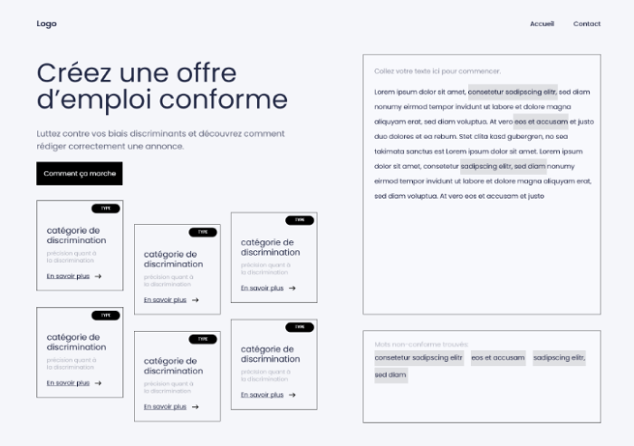
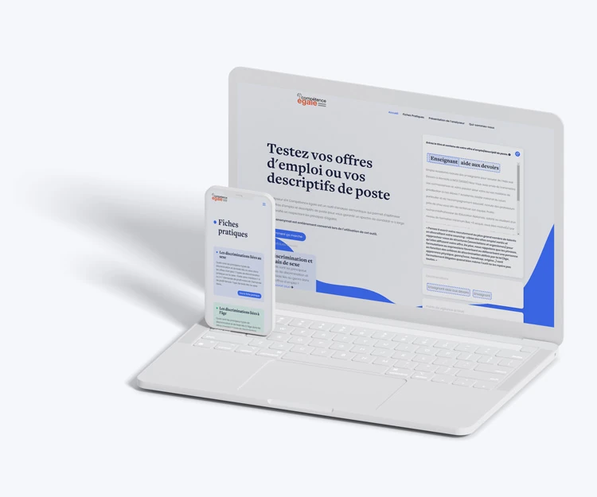

+++
title = "À Compétence Égale"
description = "Analyseur en ligne pour vérifier l'inclusivité de ses offres d'emploi"
date = 2020-09-29
[taxonomies]
tags = ["PWA", "UI Design", "UX Design"]
[extra]
image = "/portfolio/ace/intro.webp"
+++

À Compétence Égale est une association engagée depuis 2006 dans la **lutte contre toute forme de discrimination à l’embauche** et pour la promotion de la diversité dans l’emploi.

## Contexte

L’an dernier, l’association a lancé un **outil d’analyse d’offre d’emploi** afin de faire remonter à la personne chargée du recrutement les différents biais discriminants qu’elle peut contenir.

## Comment ça marche&nbsp;?

On copie-colle son annonce dans l’outil en ligne et les formulations discriminantes (qu'il s'agisse d'un biais ou d'une discrimiation illégale d’un point de vue juridique) sont mises en évidence.

Chaque famille de discrimination (genre, âge, apparence…) est divisée en différentes sous-catégories. 

Des fiches pratiques sont alors proposées à l’utilisateur·ice afin de mieux comprendre pourquoi sa formulation n’est pas idéale. *Des formulations alternatives sont également proposées.*

## Ma mission

Le challenge ici était d’aller à l’essentiel sans tomber dans la facilité. Nous avions à cœur de proposer **une interface agréable** pour un outil somme tout assez simple&nbsp;: un champ texte, des mots surlignés et un renvoi vers des fiches pratiques associées.

Au départ nous avions centré notre maquette sur le champ texte, l’annonce.

Mais au fur et à mesure que nous avancions, l’agencement paraissait déséquilibré, étriqué. Les fiches pratiques associées aux formulations discriminantes étaient **trop peu mises en valeur**. 

Pire, sur mobile elles étaient reléguées en fin de page.

**Nous avons alors retourné le problème et pris le parti de nous focaliser sur les fiches pratiques.**

La structure a alors subi une inversion du sens de lecture&nbsp;: le champ a basculé à droite sur une colonne plus étroite mais suffisante pour permettre la lisibilité une fois l’analyse lancée. 

Les fiches pratiques ont ainsi gagné de l’espace en largeur pour un résultat global plus aéré et agréable. Elles ont également retrouvé leur place “prioritaire” dans le sens de lecture.

L’annonce et les mots clés non conformes détectés s’agencent également plus harmonieusement.

✅ Un panel de test interne, au sein des équipes d’À Compétence Égale et ses partenaires (soit une dizaine de personnes sur ce projet) nous a permis de confirmer notre choix avant le design graphique et le développement&nbsp;!

