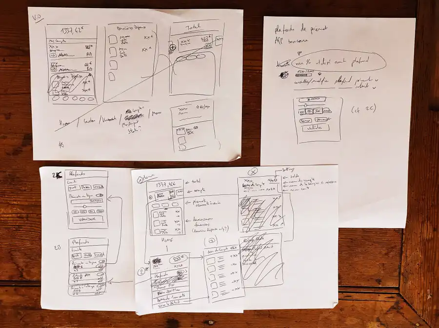
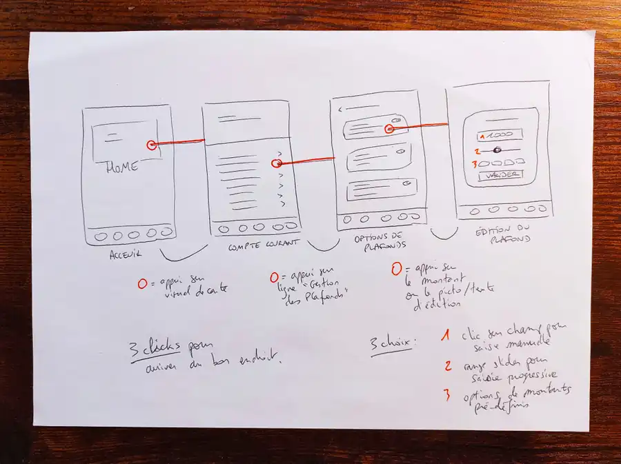
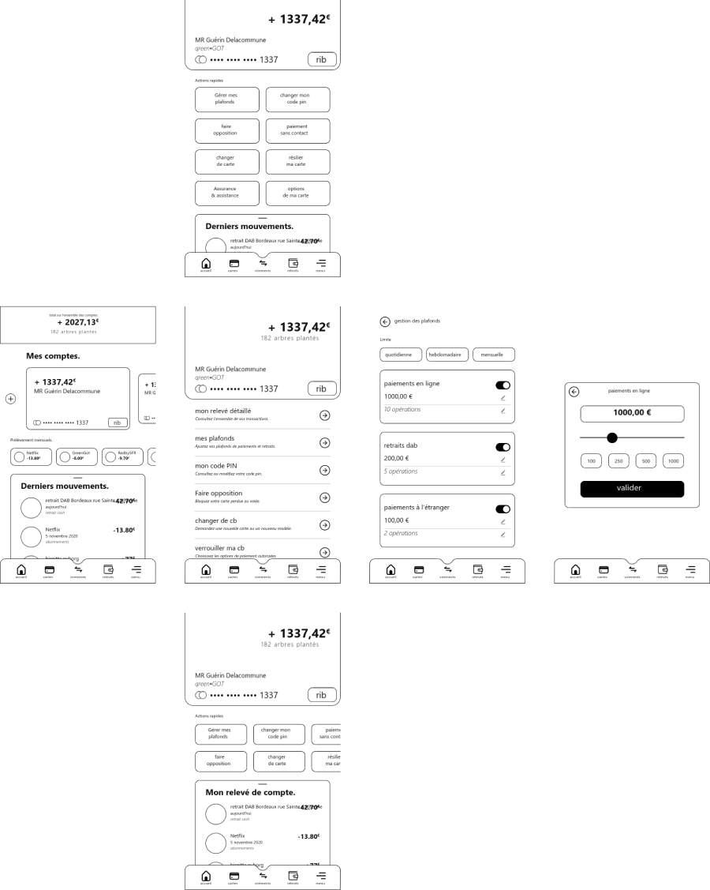
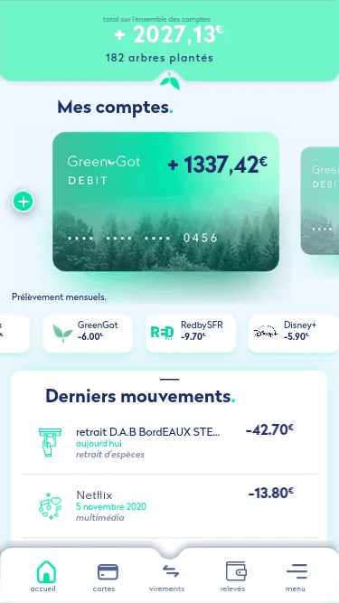
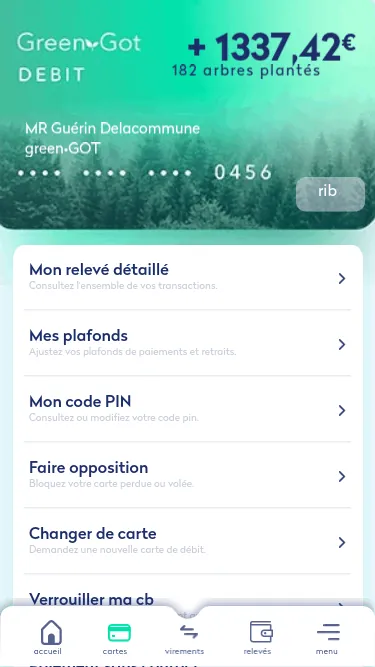
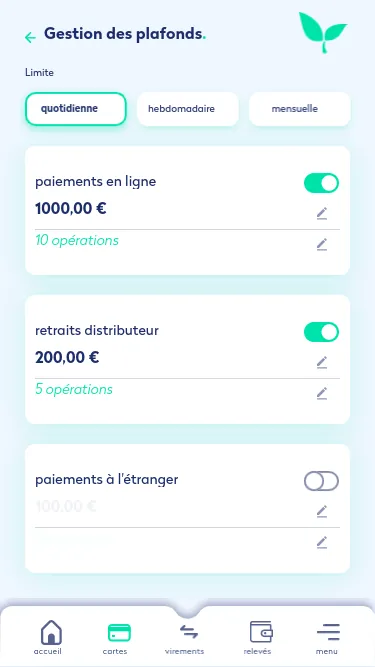
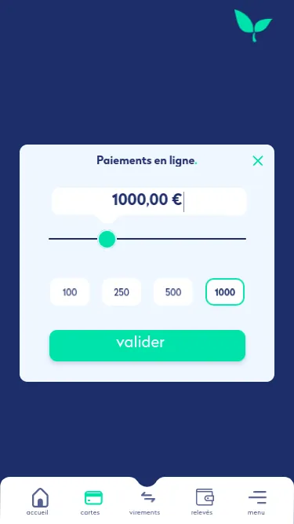

+++
title = "Green-Got!"
description = "Appli mobile pour compte bancaire responsable"
date = 2020-11-20
[taxonomies]
tags = ["Product Design", "UX Design", "UI Design"]
[extra]
image = "/portfolio/green-got/intro.webp"
+++

Dans le cadre d’un recrutement j’ai été amené à proposer ma vision pour la fonctionnalité de modification de plafonds de retrait dans l’application de la néo-banque verte Green-Got.

## Contexte

Ma mission était de concevoir la partie gestion des limites de plafonds par l’utilisateur·ice.ice de l’appli Green-Got.

Le but de ce cas pratique est de *proposer une expérience **rapide et simple** pour l’utilisateur·ice.ice* de l’app qui souhaite modifier ses plafonds de retraits et / ou paiements.

## **Recherches préliminaires**

### Première étape&nbsp;: trouver de la documentation.

Toute info qui me permettra de mieux saisir les tenants et aboutissants d’une appli bancaire ainsi que les problématiques propres au secteur.

Je m’imprègne de cet univers qui est nouveau pour moi&nbsp;: la banque et toutes ses ramifications plus spécifiques&nbsp;: FinTech, néo-banques… Un petit tour du côté des applis de transfert d’argent à la Lydia ou autre également pour compléter la vision globale.

Le leader (autoproclamé) des néo-banques, N26, n’est pas avare en compliments sur son approche mais ne rentre pas trop dans les détails du processus de conception.

Les plus bavards sont les membres de l’agence UXDA qui est carrément *spécialisée dans la conception d’applis bancaires et FinTech* (forcément, avec une telle ligne éditoriale et une centaine de projets à l’appui.)

Quelques designers, au Brésil, en Russie et même au Bangladesh partagent leur travail dans différents articles (cf. [bibliographie](#bibliographie))

### Ensuite on passe à la veille graphique.

Un petit tour sur Behance pour des interfaces “réalistes” et détaillées (certains designers ont créé des centaines d’écrans différent pour la même appli)

Un passage sur Dribbble, pour le plaisir des yeux, mais pas seulement&nbsp;: sous la couche graphique ultra-léchée on peut aussi trouver de bonnes idées structurelles ou techniques.

### Résultat des courses&nbsp;:

**Je commence à avoir une idée plus précise** des éléments primordiaux sur une appli bancaire. Et de ceux qui me paraissent améliorer l’expérience utilisateur, **apporter une plus-value à Green-Got.** Des fonctionnalités que j’aimerais avoir à portée. Celles qui doivent être les plus accessibles ou les plus rapides à activer.

Je pose mes premiers jets sur papier pour pouvoir rapidement et facilement itérer, ajuster, recommencer.

 <small>(du coup oui c’est un peu le foutoir)</small>

Je finis par avoir une vision assez claire de ce que je souhaite sur **chacun des écrans que l’utilisateur·ice.ice traversera** pour effectuer l’action de gestion des limites & plafonds.

## **Parcours utilisateur·ice.ice.**

Ces écrans, parlons-en&nbsp;: je voulais limiter autant que possible le nombre d’interactions nécessaires pour arriver à l’écran souhaité. En optimisant l'agencement de l’information je suis parvenu à un parcours assez succinct&nbsp;: en **3 clics** on est sur l’écran où l’on règle le montant du plafond sélectionné.

 <small>(on y voit plus clair hein&nbsp;? …c’est normal je l’ai refait au “propre”)</small>

Arrivé sur la page d’accueil de l’appli, **un clic sur le visuel de la carte** renvoie à une vue détaillée du compte associé. Une liste d’actions est alors présentée pour permettre la réalisation de différentes actions courantes. Dont, celle qui nous intéresse ici&nbsp;: **la gestion des plafonds.**

2ème clic donc, et nous voilà sur la page des options de plafonds&nbsp;: activer ou non une limite sur les paiements en ligne, les retraits au distributeur et enfin les paiements à l’étranger.

Chaque option affiche le montant du plafond selon la périodicité choisie (quotidienne, hebdomadaire ou mensuelle).

Un dernier clic, **sur le bouton d’édition, ou sur le montant lui-même**, ouvre une fenêtre modale permettant de changer cette valeur.

J’ai opté pour **une triple entrée** quant à la modification de cette valeur&nbsp;:

- Un *range-slider* assez classique et intuitif pour faire rapidement varier le montant.
- Le label du slider est également éditable **en saisie directe** pour l’utilisateur·ice qui souhaite un contrôle plus précis (guilty)
- Enfin, lors de ma veille j’avais trouvé une interface présentant des boutons avec **plusieurs montants prédéfinis,** pour offrir une expérience encore plus simple.

Maintenant que ce parcours est balisé, place aux wireframes pour mieux structurer les différents écrans et hiérarchiser les informations qu’on y trouvera.

## **Wireframes.**

Comme j’avais déjà posé une base assez précise sur papier, la partie wireframes fut relativement rapide. Seul **l’écran de la vue détaillée du compte** fut remanié deux fois avant de revenir au point de départ.

En effet je souhaitais que l’on puisse directement consulter les entrées et sorties d’argent du compte. Cependant, nous avions déjà une vue “mouvements” sur la page d’accueil (qui regroupe l’ensemble des comptes de l’utilisateur·ice.ce). Or il ne me paraissait **pas pertinent ni assez clair** qu’au changement d’onglet on affichait désormais les mouvements d’un seul compte. Visuellement on arrivait dans une nouvelle pièce… avec la moitié des meubles identiques (ou presque) à la précédente.

Je suis donc revenu sur ma première ébauche, **plus simple&nbsp;:** une liste des actions communes associées à la gestion du compte. Au niveau de l'intégration, cette solution propose l’avantage de **faciliter l’ajout de nouvelles fonctionnalités** puisqu’elles s’enchaînent simplement. La maquette n’a pas besoin d’être revue et corrigée à chaque nouvelle implémentation.

**Design graphique.**

Après avoir ajusté les différents éléments que je souhaitais voir sur chacun des écrans rencontrés par l’utilisateur·ice.ice lors de l’action de gestion des plafonds, place à la déco&nbsp;!

J’ai essayé de coller autant que possible aux mockups présents sur le site de Green-Got, afin d’avoir un ensemble cohérent et élégant, moderne et épuré.

Évidemment l’interface se doit d’être agréable à regarder et à utiliser, Mais je connais le piège du design irréaliste (beaucoup de *shots* sur dribbble utilisent les logos des marques pour illustrer les paiements, la faisabilité me paraissait, au mieux, bien trop complexe comparé au gain en qualité d'expérience.)

J’ai opté pour des icônes minimalistes pour catégoriser les différents mouvements d’argent&nbsp;: on a ainsi une interface **moins austère** et *on reste dans le cadre du techniquement réaliste*.(Peut-être faudrait-il varier les teintes des icônes pour faciliter la lecture de la catégorisation pour l’utilisateur·ice.ice)

## **Animation de la maquette.**

J’ai ajouté quelques animations sur Xd pour aider à mieux retranscrire ma vision des enchaînements d’écrans.

[Télécharger le fichier source .xd](https://drive.infomaniak.com/app/share/388223/d37f3b54-0669-49d6-b2b2-e278948fb853)

## **KPIs.**

Plusieurs indices de performances sont envisagés afin d’estimer l’efficacité de la solution choisie et son implémentation:

- Pourcentage d’actions sans erreur
- Temps passé pour compléter l’action
- Pourcentage d’utilisateur·ices utilisant l’action
- Fréquence d’utilisation pour les utilisateur·ices concernés
- Taux de rebond (retour / annulation avant finalisation)

Idéalement des demandes de feedback pourraient être poussées dans l’app, par exemple lors de la première fois que la solution est utilisée, pour que l’utilisateur·ice.ice note son expérience.

---

## **Bibliographie**

[FRC.Bank: UX Case Study. by Archetype Agency | by Archetype agency](https://medium.muz.li/frc-bank-ux-case-study-abb3e79e456b)

[UX Case Study: The Most Beautiful and Awarded Banking App Design](https://www.uxdesignagency.com/blog/ux-design-case-study-most-beautiful-banking-in-the-world)

[A new experience of daily mobile banking — a UX case study](https://medium.com/@pierredeg/a-new-experience-of-daily-mobile-banking-a-ux-case-study-c69a2651e13)

[UX Case Study: How to Create a Mobile Banking Super App](https://www.uxdesignagency.com/blog/ui-ux-design-of-challenger-bank)

[Banking App — UX Case Study and Design | by Awesome Sid | Siddharth's Design Portfolio](https://medium.com/siddharth-design-portfolio/banking-app-ux-case-study-and-design-c2aa363d8651)

[Building a personal financial app — a UX case study](https://uxdesign.cc/building-a-personal-financial-app-a-ux-case-study-4fb40f636c25)

[UX Case Study: Mobile Banking Apps | by Dan Ryland | Ryland Consulting - Full Service Digital Agency in London](https://medium.com/ryland-consulting/ux-case-study-mobile-banking-apps-fade4b480622)