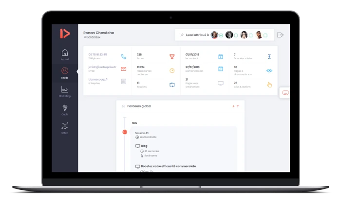
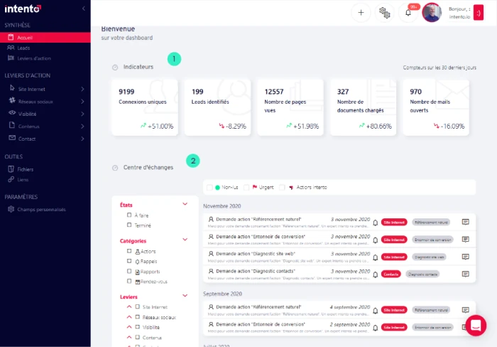
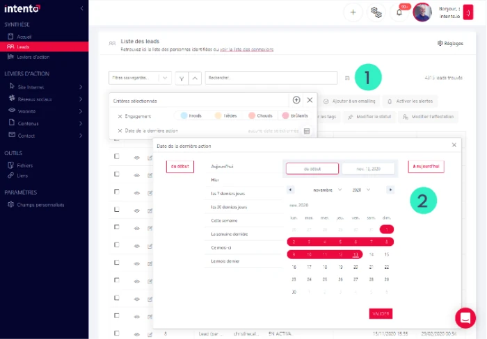
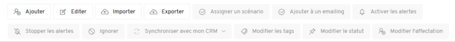
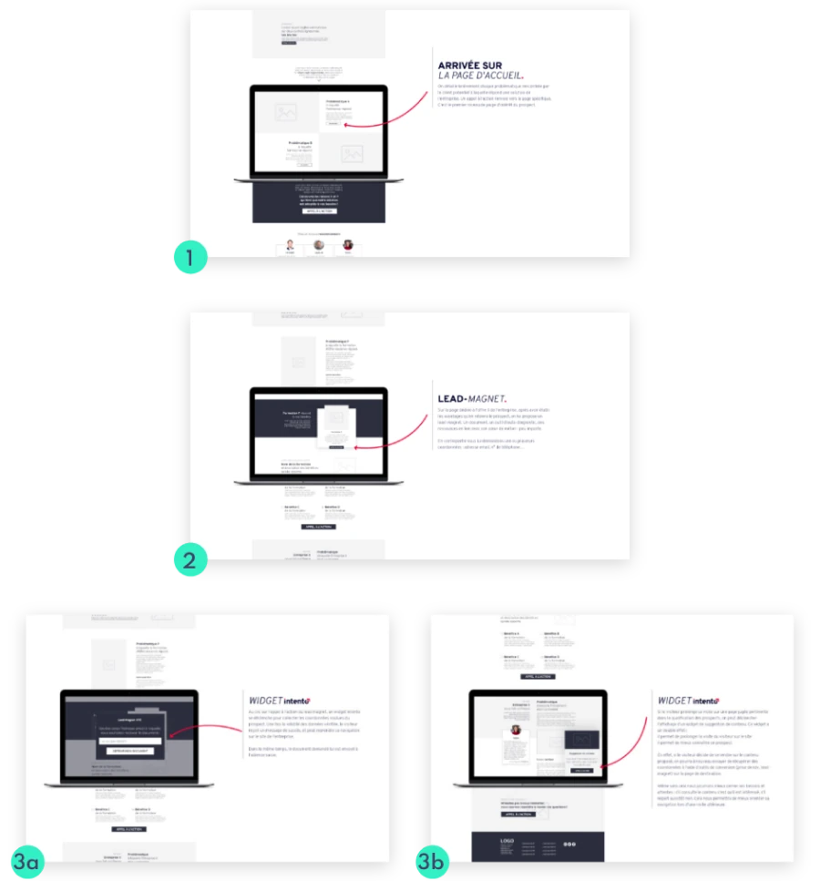

+++
title = "intento"
description = "Application métier de suivi de prospects"
date = 2020-03-27
[taxonomies]
tags = ["Appli métier", "UX Design"]
[extra]
image = "/portfolio/intento/intro.webp"
+++

## Contexte

L’application intento est **la pierre angulaire de l’offre&nbsp;:** centre de coaching, suivi & analytics, micro-CRM… l’outil se veut le plus complet possible pour les PME.

Le challenge a donc été de rendre cette appli **claire et lisible malgré la quantité d’informations disponibles**. La cible étant très peu à l’aise avec les outils numériques, il fallait être le plus intuitif possible. Après la mise en place d’un prototype bricolé à quatre mains avec le fondateur, une équipe de développeurs a été recrutée pour faire les choses proprement.

 <small>version antérieure de l’application, basée sur un template de back-office pré-construit.</small>

L’application était déjà **en constante évolution, grâce, entre autres, aux retours de nos clients** en plus de notre utilisation interne. Au fil du temps de nouveaux besoins ont émergés et, à l’inverse, certaines fonctionnalités s’avèrent très peu utilisées.

Nous en avons profité pour revoir notre copie.

Il a alors été décidé par l’équipe de développement de se baser sur la [libraire Ant](https://ant.design/components/overview/) qui leur donnait accès à un **design system et à des composants React.js** pré-configurés pour faciliter l’implémentation de nouvelles fonctionnalités. 

En amont des premières ébauches, nous avons diffusé un google form pour récolter l’avis de nos utilisateurs sur différentes idées que nous avions. Nous les avons également invités à nous faire part de leurs envies ou besoins pour la nouvelle version de l’outil.

✅ Me concernant, il a fallu repenser une partie des différentes vues de l’application, **en particulier l’écran d’accueil.** Il était primordial également d’améliorer la présentation et la hiérarchisation de l’information au sein de l’outil.

## Centre de coaching

C’est ainsi que la page principale du *dashboard* a été complètement revue pour se concentrer sur **le centre de coaching** par lequel intento communique avec ses clients.

➡️ Les statistiques et métriques qui paraissaient importantes aux yeux de l’équipe marketing n’étaient que **très peu consultées** par les utilisateurs finaux de l’app.

L’utilisateur y retrouve donc désormais en premier lieu des **indicateurs de performance** 1 sur les performances de ses supports numériques (site internet mais également documents et e-mails)

Puis vient le centre d’échange 2 où les équipes d’intento fournissent des **rapports réguliers sur l’efficacité des actions menées.**

Elles peuvent également proposer des ajustements dans les campagnes en cours ou suggérer des actions complémentaires à mettre en place.

Cet espace d’échange, appelé le centre de coaching a donc **emprunté les codes de la messagerie.** La volonté était de faire de l’application le centre de nos communications avec les clients en utilisant des interfaces familières. 

➡️ La boîte mail étant le B.A. BA du numérique, interagir avec nos clients de cette manière nous a paru la solution la plus adaptée pour faciliter l’adoption de l’outil.

## **Liste des prospects qualifiés *(leads)***

L’autre page majeure de l’app intento c’est la vue «leads»&nbsp;: **l’ensemble des contacts, qualifiés, générés par les actions intento.**

La liste est parfois longue&nbsp;: il a très vite été demandé de **proposer des filtres** et la possibilité de sauvegarder ces critères pour des consultations ultérieures. 1

Cependant, proposer l’ensemble des filtres possibles dans un seul écran était impossible&nbsp;: trop d’informations, trop chargé. Nous avons donc **catégorisé les filtres** selon différents «critères» qui déploient chacun un sous-menu déroulant adéquat. 2

Les options d’interaction avec la liste de contacts sont également de plus en plus nombreuses à chaque nouvelle fonctionnalité implémentée. Leur présentation dans une colonne latérale n'était plus adaptée.

Nous devions répondre à deux objectifs&nbsp;: avoir un menu d’actions facile d’accès et qui puisse accueillir de nouvelles options au fil du temps. 

C’est pourquoi, il a rapidement pris la forme d’une toolbar, proche des outils de traitement de texte qu’utilisent beaucoup nos cibles, et **plus évolutive sur la durée**.

## Parcours utilisateur

L’une des actions menées par intento pour transformer des visiteurs en leads qualifiés pour ses clients consiste à afficher des modules dynamiques **en fonction de la navigation du visiteur.** 

Selon le temps passé sur une page, la thématique du contenu consulté, le nombre d’interactions entre le visiteur et les supports du client, différents types de «widgets» sont affichés et **invitent le visiteur à interagir.** 

Il fallait donc schématiser un parcours utilisateur complet pour définir le widget le plus pertinent **selon la maturité du visiteur.**

