+++
title = "Mangane"
description = "Une alternative libre et locale aux réseaux sociaux centralisés"
date = 2021-01-29
[taxonomies]
tags = ["PWA", "UX Design"]
[extra]
image = "/portfolio/mangane/intro.webp"
+++

[Clovis](https://bdx.town/@clovis), la personne à l’origine du projet, a sollicité mon aide pour améliorer l’expérience proposée aux utilisateur·ices de [BDX.town](https://bdx.town).

Nous partions d’une base graphique et fonctionnelle existante, mais avions tous deux l’envie d’aller plus loin et de **proposer des fonctionnalités non présentes** afin de faciliter la prise en main et l’adoption de ce réseau décentralisé.

## Contexte

### Origine
Mangane, ça veut dire "voyou" en [bordeluche](https://fr.wikipedia.org/wiki/Bordeluche) (le patois Bordelais). 

C'est le nom que l'on a donné au [logiciel](https://github.com/Cl0v1s/mangane-ui) qui fait tourner notre réseau social local (mais ouvert sur le reste du monde), sans pub, et sans marchandisation des données personnelles.

### Manifeste
Nous souhaitons que cette plateforme de microblogging <i>à la Twitter</i> soit un espace **d'échange et d’entraide local** pour les artistes, les créateur·ices, les artisan·es engangé·es de Bordeaux et ses alentours.

En plus d’un fil chronologique des gens que vous suivez, vous avez accès à un fil regroupant toutes les personnes de BDX.town ainsi qu’un troisième, regroupant nos “voisins” en ligne.

En effet, Mangane communique avec l'ensemble du fediverse [⁽¹⁾](#note1) (Federated Universe), fort de 2M+ d’utilisateurs. Nous n’évoluons donc pas en vase clos.

## Annuaire des membres

Pour faciliter la découverte de profils intéressants à suivre sur ce nouveau réseau local, nous souhaitons que Mangane propose un **annuaire des membres**. 

Mastodon et Misskey, deux autres logiciels similaires du fediverse en proposent et leur utilité n’est plus à démontrer. 

### Veille “concurrentielle”

Avant d’aller voir ce qui se fait ailleurs, récapitulons *ce qui se fait déjà* à l’heure actuelle sur l’interface Mangane. Ces “cartes” serviront de référence pour l’annuaire&nbsp;:

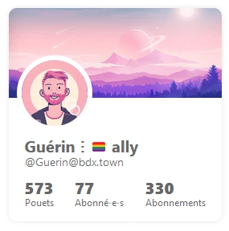
 <small>Vue du profil perso sur la page d’accueil</small>

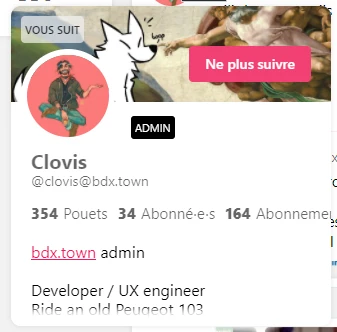
 <small>Vue d’un profil au survol de l’avatar d’une personne sur un fil</small>

➡️ Rapidement, le sentiment que le nombre d'abonné·e·s et d'abonnements *ne sont pas **des données utiles** pour décider ou non de suivre une personne* s’impose à moi. Ces "vanity metrics" peuvent accroître l'addiction aux réseaux ce qui n'es pas notre objectif.

Le **nombre de publications** est un indicateur (on peut rechercher des gens qui publient souvent, ou à l’inverse fuir les trop “bavards”) mais il n'est pertinent qu'avec une date d'inscription afin d’obtenir **une fréquence**.

Idéalement, il faudrait n’afficher que cette fréquence, la plus utile, pour alléger l’interface.

⚠️ **Bémol cependant**&nbsp;: un utilisateur inscrit depuis longtemps qui n’aurait commencé que récemment à publier beaucoup présenterait *une fréquence faussée* le temps que la donnée se stabilise sur la durée.

#### Mastodon

Au premier abord Mastodon propose sensiblement les mêmes infos&nbsp;: bannière, photo de profil, bio, nombre de publications et d’abonné.

Le logiciel se démarque en proposant la donnée **"dernière activité"** qui permettrait justement de mieux jauger la “vivacité” d’un compte et éviter de suivre un profil inutilisé...

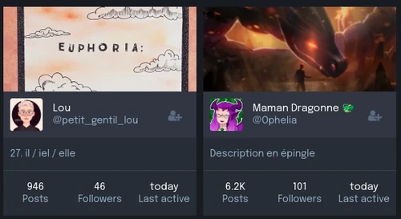

Sur son annuaire Mastodon propose des vues filtrables (actifs récemment ou nouveaux arrivés, profils locaux ou fédérés.)

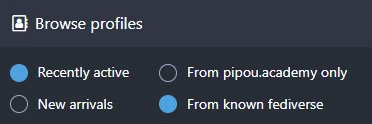

#### Misskey

Misskey propose exactement les mêmes informations que Mangane, bannière, avatar, bio, nombre de publications, d’abonnés & d’abonnements.

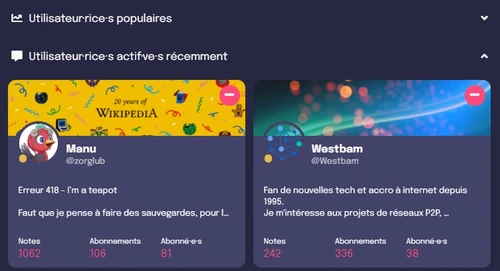

L’annuaire Misskey propose des “utilisateur·ices épinglé·es”, soit une sélection des admins de l’instance.

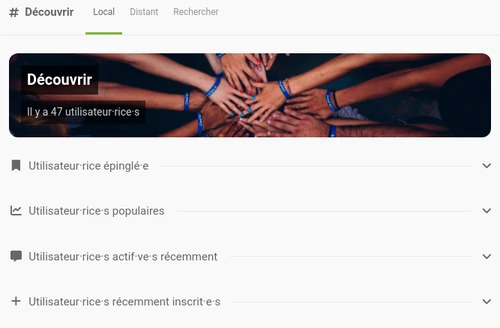

### Ma proposition

Compte-tenu de ces différentes considérations j’ai entamé une phase d’itération du rendu.

L’interface étant déjà en ligne, et la structure assez simple, j’ai maquetté directement en rendu “final” en modifiant les éléments dans l’inspecteur ou en recréant certains composant sur Xd afin de rapidement me rendre compte de l’efficacité ou non des différentes mises en page.

Par rapport à la carte utilisateur par défaut, j’ai **retiré les données inutiles**, on a donc gardé le nombre de messages et la dernière activité&nbsp;:

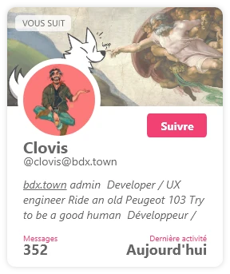

J’ai également envisager d’afficher **le statut en ligne / hors ligne** plutôt que le nombre de messages mais l’information faisait un peu doublon avec la dernière activité. En plus d’être *peu pertinente dans la décision ou non de suivre un compte*.

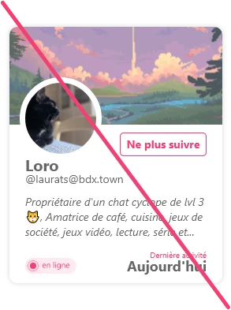

Une autre piste, plus vertueuse peut-être, m’est alors venue en tête&nbsp;: supprimer carrément toute la data et ne reposer sa décision que sur la bio de la personne.

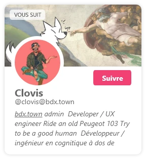

Une version minimaliste donc, pour éviter la course aux métriques et l’effet boule de neige des “gros” comptes qui grossissent encore.

Une version qui me plaisait bien et que j’aurais probablement proposée mais...

*car il y a un mais.*

 <small>Un utilisateur avec une très courte bio</small>

Le rendu est très vide si l'utilisateur a une mini bio et pire encore s’il n’a aucune bio renseignée.

➡️ L’hypothèse d’une construction en *masonry* avec des cartes de profils à hauteur variable s’est posée. Cependant pour une meilleure lisibilité nous avons fait le choix de rester sur une grille classique, à hauteur fixe.

Ma proposition finale fut donc ma première version. En effet la présence de la data considérée comme pertinente casse l’impression de vide dans le cas d’une bio minimale ou absente.

Parfois on tape juste du premier coup mais on ne s'en rend compte qu'en expérimentant d'autres pistes. 😅

Mise à jour&nbsp;: l’interface de BDX.town ayant évolué en parallèle, j’ai légèrement revu ma copie (au niveau UI) pour l’annuaire de membres&nbsp;:

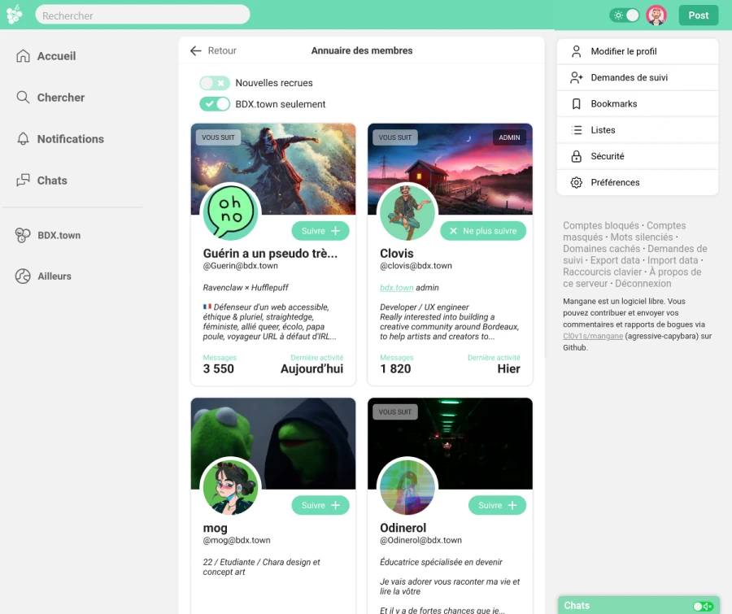
<a href="https://www.figma.com/proto/lOmoWp7cuw14qYPvZuoCFs/bdx.town---Design?node-id=3%3A1023&viewport=59%2C777%2C0.47&scaling=scale-down-width&page-id=0%3A1&starting-point-node-id=3%3A1023" target="_blank" rel="noopener">Voir la maquette interactive</a>

## Onboarding

À la manière de ce que proposait Mastodon, nous souhaitons mettre en place un petit “*onboarding*” pour **aider les nouveaux arrivants** à facilement trouver leurs repère sur l’interface de Mangane.

### Veille “concurrentielle”

Seul Mastodon proposait une modale d'introduction lors de l’inscription sur une instance. Elle expliquait le principe des instances (qui diffère des réseaux sociaux “classiques” centralisés), et les différents fils d’actualités qu’on peut consulter.

Dans ses premières versions, Elle expliquait le fonctionnement du @pseudo@instance (par opposition au @pseudo simple de Twitter)&nbsp;:

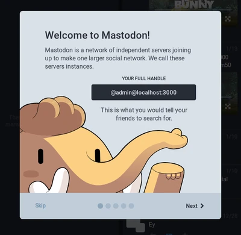

La dernière version, dans l’optique de réduire le nombre d’étapes, avait supprimé cette information&nbsp;:

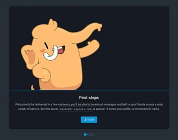

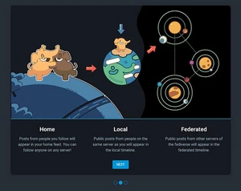

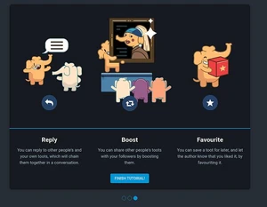

Cependant son utilité réelle restait discutable&nbsp;: quel besoin de rappeler le nom du serveur sur lequel on vient de se créer un compte&nbsp;? Y a-t-il réellement besoin d’expliquer qu’on peut répondre, partager et mettre en favori les contenus présentés&nbsp;?

Cet onboarding est d'ailleurs, depuis 2020, remplacé par un email qui renvoie vers quelques pages de réglages et configuration.

### Ma proposition

J’ai alors commencé à lister **les différents éléments** qu’on pouvait inclure dans l’onbording de Mangane avant de les trier **par ordre d’importance**. 

Nous avons ainsi pu décider quelles infos méritaient de figurer et lesquelles n’étaient pas indispensables avant d’organiser les différents écrans de l’onboarding, sans le surcharger.

**✅ nécessaire**

- explication du @pseudo
- présentation des fils
- possibilité de passer / revoir l’onboarding dans l'UI

**👍 pertinent**

- suggestions de comptes à suivre
- options de confidentialité 
- rappel du code de conduite de Mangane

**❓ secondaire**

- présentation du mode *chat*
- présentation des réglages avancés

Dans une volonté de ne pas imposer un *onboarding* trop long, ma proposition s’est arrêté sur **4 étapes**&nbsp;:

1. **Bienvenue** → explications de l’interconnexion entre les instances à la manière des emails + rappel du nom d’utilisateur complet @pseudo@instance
2. **Présentation des timelines** → le fil personnel (les gens suivis), le fil local (”bdx.town” pour les gens de la même instance) et le fil fédéré (”découvrir”, pour les voisins)
3. **Présentation des options de confidentialité** → définir si le profil publie en public ou en privé, si les gens peuvent s’abonner sans confirmation, si le profil est répertorié sur l’instance et sur les moteurs de recherche.
4. **Suggestions d'actions à mener** → et rappel du code de conduite.

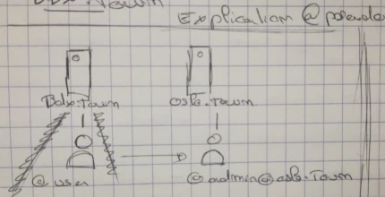

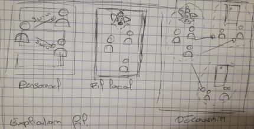

<small>Schémas de Clovis</small>

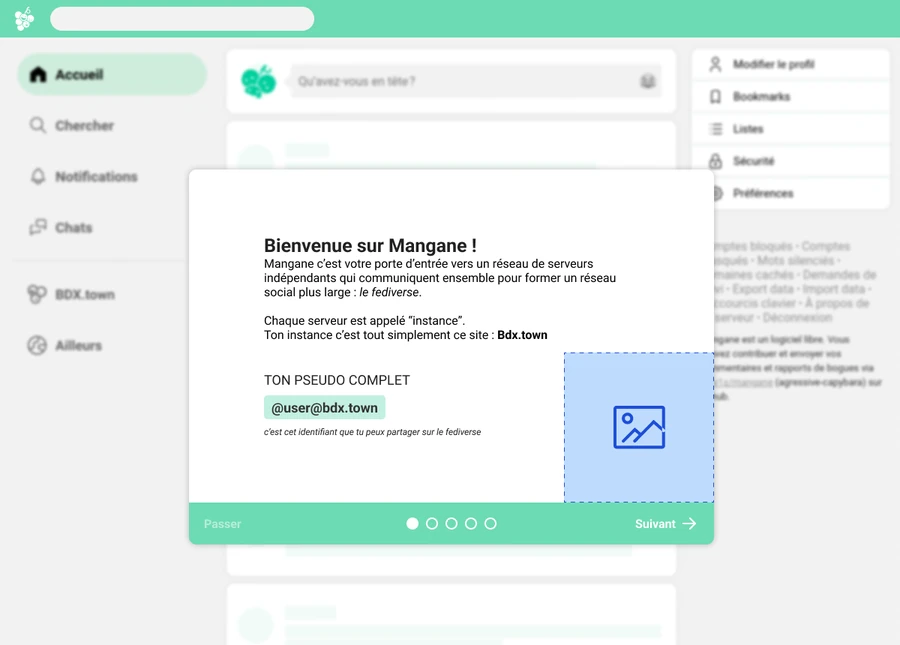
 <small>*Design final <i>(Work in progress, en attente des illustrations finales)</i></small>
<a href="https://www.figma.com/proto/lOmoWp7cuw14qYPvZuoCFs/bdx.town---Design?node-id=7%3A1198&viewport=-92%2C262%2C0.16&scaling=min-zoom&page-id=0%3A1&starting-point-node-id=7%3A1198" class="fk-button" target="_blank" rel="noopener">Voir la maquette interactive</a>

Enfin, en suivant l’exemple de Mastodon depuis 2021, plutôt que d’emmener les utilisateurs sur une timeline vide à leur inscription, nous avons souhaité les diriger vers une liste de profils à suivre (l'[annuaire](#annuaire-des-membres) sur lequel nous avons travaillé en premier).

<section class="notes">

## Notes {.fk-small}

1. Imaginez pouvoir suivre un compte instagram avec votre compte twitter&nbsp;? Ou commenter une vidéo youtube avec votre profil facebook&nbsp;? Sur le fediverse c’est “possible”&nbsp;: sauf que vos plateformes habituelles n’ont pas le même nom.  Un compte Mangane sur BDX.town vous permet par exemple d’interagir avec les vidéos postées sur PeerTube, les photos partagées sur PixelFed, les blogs écrits sous Plume ou WriteFreely ou même les évènements organisés sur Mobilizon. <a href="#text-note1">U</a>

</section>