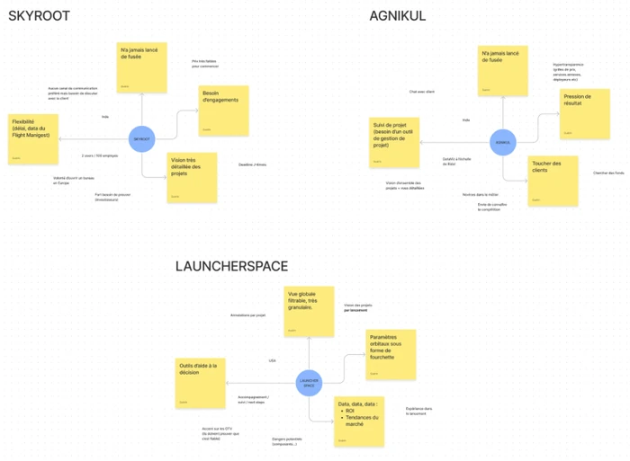
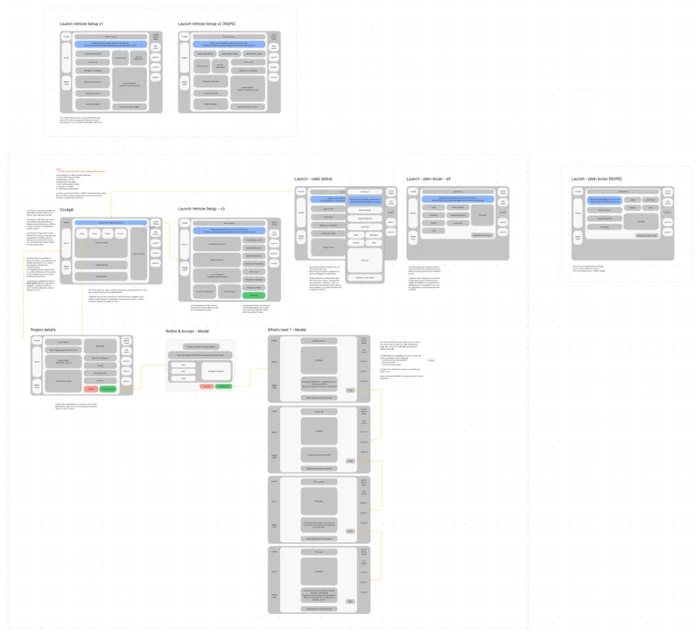
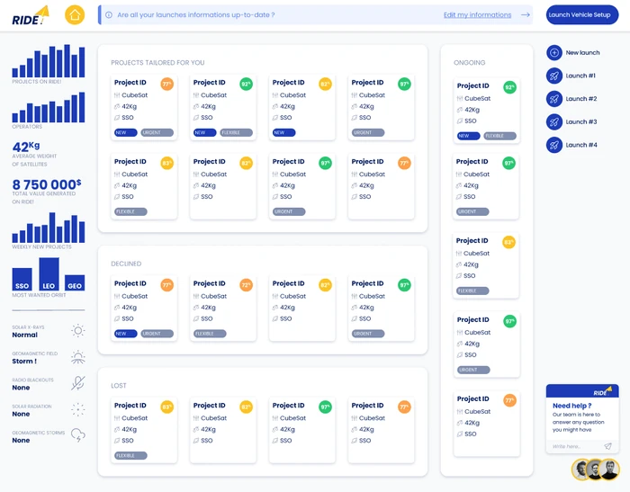
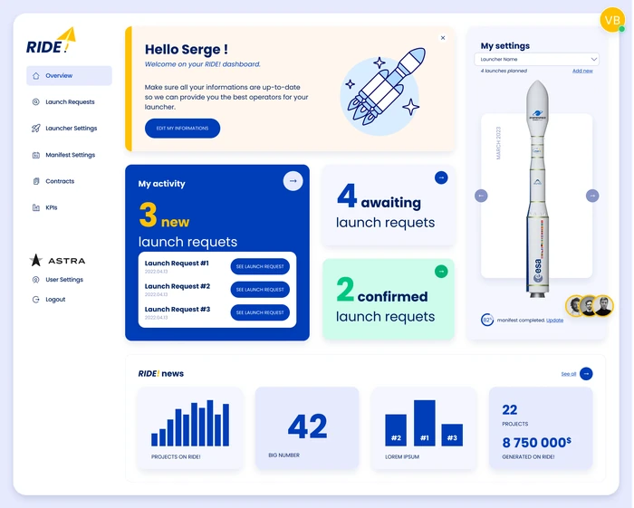

+++
title = "Ride!"
description = "Mise en relation de lanceurs de fusées et d'opérateurs de satellites"
date = 2021-04-21
[taxonomies]
tags = ["Product Design", "User Research", "Appli métier"]
[extra]
image = "/portfolio/ride/intro.webp"
+++

Ride! est une jeune start-up parisienne qui met en relation des lanceurs de fusées et des opérateurs de satellites.
À partir de critères précis, tels que l’orbite souhaitée, la date de lancement, le poids et les dimensions du satellite Ride! fait du “match-making” pour faciliter la prise de contact et la négociation de contrats entre les acteurs du marché.

## Contexte

Ride&nbsp;! avait besoin d’une vision “Produit” pour son outil SaaS avant développement d’une première version. 

Ils ont fait appel à moi pour mener, en duo avec leur CTO, des entretiens avec leurs clients potentiels. J'ai également dirigé un atelier UX dans leurs locaux afin de cadrer leurs objectifs, leurs besoins et ceux de leurs cibles. 

Nous avons ainsi pu baliser le spectre de la v1 de leur application métier.

## Entretiens utilisateurs

Avant de rencontrer l’équipe au complet et d’animer l’atelier de réflexion UX, j’ai mené, avec Lucien le CTO de Ride! plusieurs entretiens. Nous avons, ensemble, interviewé des représentants de différents lanceurs de fusées, indiens, chinois, américains…

Lors de ces entretiens, nous avons récolté des informations concernant leurs attentes vis-à-vis de l’accompagnement et de la solution proposée par Ride!
Ces intervenants avaient des profils assez variés, tant culturels qu’au niveau de la maturité de leur entreprise, même si Ride! ciblait en particulier les *“new players”* ces lanceurs qui préparent leur premier vol.

Nous avons ainsi pu établir une liste de besoins, d’attentes, d’informations nécessaires pour les différents lanceurs afin de prendre une décision. Nous avons également noté leurs attentes concernant le rôle de Ride! et son accompagnement dans ce processus de mise en relation.

<a href="https://www.figma.com/embed?embed_host=share&url=https%3A%2F%2Fwww.figma.com%2Ffile%2FnEJUSZEadcbz1ovE4BwdKo%2FCartes-Cognitives%3Fnode-id%3D0%253A1" target="_blank" rel="noopener">Voir les cartes</a>

Par exemple, les deux lanceurs indiens voyaient en Ride! un éventuel outil de gestion de projets, ce qui dépassait le cadre initialement pensé par les fondateurs. Lorsqu’un troisième acteur a exprimé cette notion de “suivi de projets” avec une vue filtrable, très granulaire, nous avons ajouté cette piste à notre travail de réflexion.

## Atelier UX

J’ai segmenté cet atelier en divers petites activités:

- Atelier de découverte (45mn)
- Atelier d’empathie (30mn)
- Mind maps (45mn)
- Atelier de conception (2h)

Après avoir pris le temps de m’imprégner plus encore des spécificité de la SpaceTech et des métiers des lanceurs de fusées comme des opérateurs satellites j’ai demandé aux fondateurs d’adopter la vision de leurs clients.

Avec les informations récoltées lors des entretiens préliminaires avec différents prospects, je leur ai fait confronter leurs attentes et leurs besoins *“business”* à celles de leurs cibles. 

Nous avons ainsi réussi à sortir du mode de pensée “nous avons de X pour notre algorithme de “*match-making”* et à s’attacher plus profondément aux *metrics* qui importent pour l’utilisateur.

Après avoir trouvé le compromis idéal entre les besoins business de Ride! et les attentes fonctionnelles de leurs cibles nous avons remis à plat les informations retenues de différents entretiens et dressé des cartes cognitives. Nous avons également procédé à hiérarchiser les besoins et envies des différents clients potentiels.

Nous avions ainsi une vision plus claire des besoins primaires et secondaires auxquels Ride! se devait de répondre pour attirer sa cible. Nous avions aussi pu clarifier les éléments dont Ride! avait besoin de son côté. 

C’est alors, tous ensemble, que nous avons abordé l’étape la plus importante de ce workshop&nbsp;: l’atelier de conception.

En partant des mind maps nous avons listé, trié et hiérarchisé l’ensemble des informations et fonctionnalités que nous souhaitions proposer. Nous avons alors pu les répartir sur les différents écrans de l’application.

C’est à partir de cette base que j’ai pu m’atteler aux wireframes des différents écrans de l’appli.

### Wireframing

L’objectif était de proposer une interface simple où la quantité d’informations nécessaire ne soit pas étouffante pour l’utilisateur. La hiérarchisation des thématiques et des besoins m’a permis de rapidement arriver à une première ébauche de structure.

Le “cockpit”, l’écran présentant les différents projets susceptibles d’intéresser le lanceur, a logiquement vu les projets proposés mis en avant, tandis que les projets déclinés ou perdus étaient relégués en bas de page. Le choix a été fait d’avoir les projets “en cours” sur le côté pour les dissocier des autres tout en les laissant rapidement accessibles.

Les écrans de configuration du lanceur (le type de fusée) et des lancements (chaque vol) ont été un peu plus sujets à discution étant donné la quantité de champs à y intégrer. Nous avons d’abord opté pour une mise en page type “profil” avec des champs éditables à la volée pour sortir du ressenti “formulaire” indigeste.

Une piste de travail, finalement abandonnée, proposait d’utiliser un volet déroulant pour éditer les informations des vols depuis l’écran de configuration du lanceur, la quantité d’informations étant bien moindre. En effet chaque vol reprend en grande partie les informations renseignées dans le lanceur.

<a href="https://www.figma.com/file/wWtrbznTqhONHUrHfv81Ha?embed_host=share&kind=&node-id=0%3A1&viewer=1" target="_blank" rel="noopener">Voir les wireframes</a>

L’arborescence de l’application étant assez simple, j’avais fait le pari de nous passer de “menu” classique. On accédait au “cockpit” via un bouton fixe en haut à gauche et à ses lancements via la barre latérale droite avec ses accès rapides aux réglages et aux différents lancements.

J’ai tiré l’inspiration de ce qui se fait sur les réseaux sociaux où les espaces latéraux sont utilisés pour afficher des “sidebars” fixes.

Pour peupler celle de droite j’ai décidé d’intégrer la dataviz et un widget de météo spatiale, deux choses dont nous avions parlé lors de l’atelier UX comme des bonus.

## UI Design

### Premier jet

Assez logiquement mon premier jet a suivi presque à la lettre les wireframes.

Mais rapidement nous avonssenti que ça ne convenait pas. Au-delà du rendu purement graphique, la navigation n’était finalement pas claire, les messages d’information ou d’alerte n’étaient pas assez identifiés avec leur placement dans ce qui ressemblait finalement à une barre de menu vide.

La lisibilité du dashboard était aussi à revoir&nbsp;: les projets suggérés ne se différenciant pas assez de ceux refusés ou perdus, ni de ceux en cours. On avait donc une trop grande quantité d’informations similaires.

La dataviz venait en prime alourdir la lisibilité de l’ensemble.

Nous avons alors fait de nouveaux entretiens utilisateurs avec différents clients potentiels, en leur montrant les écrans de cette v1 et en récoltant leur ressenti et leurs retours. Pour certains interlocuteurs nous avons opté pour un entretien assez directif où nous expliquions les écrans et les interactions possibles. Pour d’autres nous avons juste montré l’écran et les avons laissé “deviner” et observer leur façon d’interagir.

Nos doutes ont alors été confirmés et nous avons refait un point interne pour recadrer la direction prise à la lumière de tous ces retours

### Version validée

Le premier grand changement a été de rajouter un vrai écran d’accueil à l’application. Les retours étaient nombreux quant au fait que l’utilisateur se sentait projeté sur un écran complexe.

Nous avons donc créé cette page “overview” qui sert de sommaire aux différentes sections de l’application (accès aux projets, accès rapide aux réglages et à la création d’un nouveau lancement…)

C’est sur cett écran d’accueil que la dataviz a été intégrée, libérant l’espace à gauche pour un menu devenu nécessaire et offrant les repères attendus par les utilisateurs.

<a href="https://www.figma.com/proto/wE2GUsO5zHSS0doQLo6Lms/RIDE!-Launch-Provider-App-Beta?node-id=1123%3A396&viewport=1582%2C250%2C0.09&scaling=scale-down-width&page-id=0%3A1&starting-point-node-id=1123%3A396" target="_blank" rel="noopener" class="fk-button">Voir la maquette interactive</a>

L’écran présentant les projets a lui aussi simplifié&nbsp;: les projets proposés sont désormais sur une seule ligne, et filtrables pour répondre au besoin de granularité exprimé par différents clients potentiels.

Les projets acceptés/validés ont quitté leur barre latérale pour apparaitre juste en-dessous. Les informations affichées sur ces projets permettent de suivre l’avancement de la collaboration entre les lanceurs et les opérateurs.

Enfin, les projets perdus et déclinés ont été fusionnés dans une même section, sous forme de tableau plus compact.

Les écrans de configuration des lanceurs et des différents vols ont quant à eux conservé sensiblement leur forme initiale.

Des entrées “contracts” et “KPIs” ont été prévues pour une v2 de l’application, toujours dans une logique de proposer un suivi de projet accru aux utilisateurs le souhaitant.